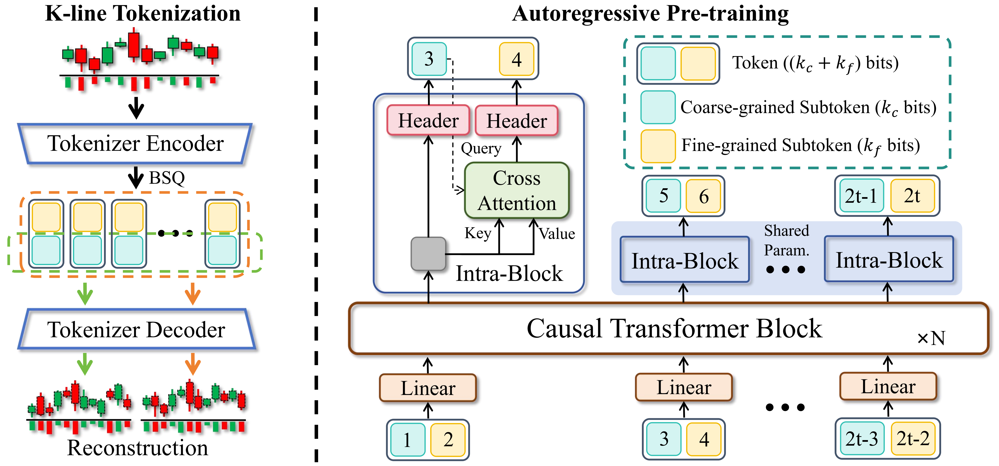
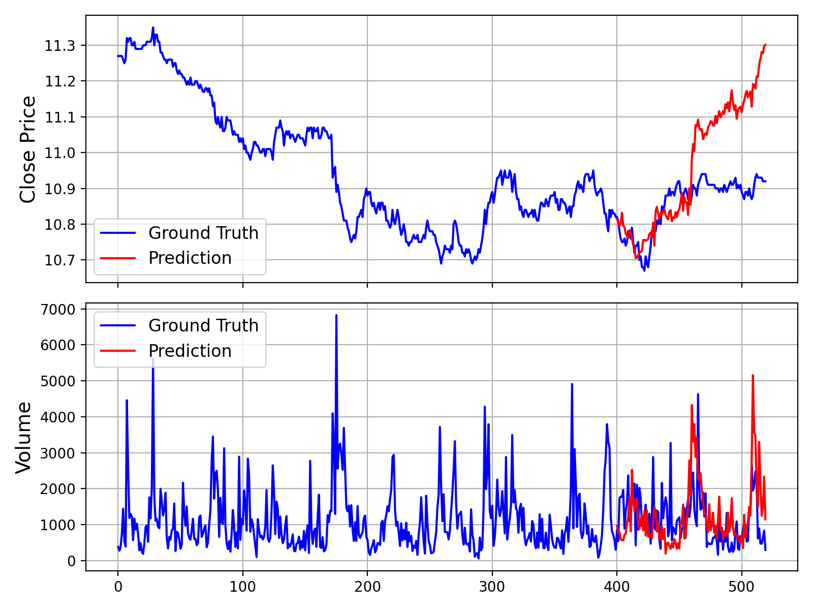
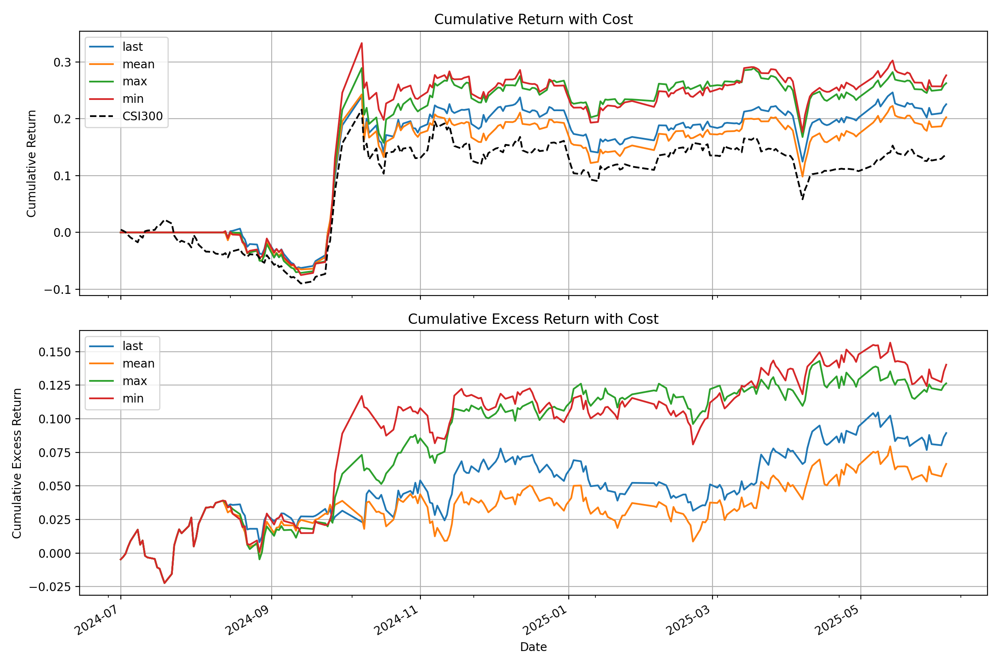

<div align="center">
  <h2><b>Kronos: A Foundation Model for the Language of Financial Markets</b></h2>
  <p><i>+ an AI Stock Assistant built on top of it (auto data, chat, news, charts, Discord/WhatsApp)</i></p>
</div>

## Table of contents

1. [What's in this repo](#whats-in-this-repo)
2. [Setup (step by step, all platforms)](#setup-step-by-step-all-platforms)
3. [Running it](#running-it)
4. [Troubleshooting](#troubleshooting)
5. [How it works, end to end](#how-it-works-end-to-end)
6. [File-by-file explanation](#file-by-file-explanation)
7. [Feature map](#feature-map)
8. [Known limitations](#known-limitations)
9. [Kronos base model -- original documentation](#kronos-base-model----original-documentation)

---

## What's in this repo

This project started as **Kronos**, an open-source transformer model that forecasts
OHLCV (open/high/low/close/volume) financial time series. On top of that base model,
this repo adds an `assistant/` package and `integrations/` package that turn it into a
conversational AI stock analysis tool -- similar in spirit to apps like Alva AI, but
built around Kronos as the forecasting engine.

**Nothing in the original Kronos code was modified.** `model/`, `finetune/`,
`finetune_csv/`, `examples/`, `webui/`, `yahoopredict.py`, and `csvpredict.py` are all
untouched. Everything new lives in `assistant/`, `integrations/`, and `chat_cli.py`.

```
Kronos-master/
├── model/                    <- original Kronos model code (untouched)
├── finetune/, finetune_csv/  <- original finetuning pipelines (untouched)
├── examples/                 <- original example scripts (untouched)
├── webui/                    <- original Flask web UI (untouched, still CSV-based)
├── yahoopredict.py           <- original single-ticker script (untouched)
├── csvpredict.py             <- original CSV-based script (untouched)
│
├── assistant/                 <- NEW: the AI assistant's business logic (13 files)
├── integrations/               <- NEW: thin Discord / WhatsApp adapters (2 files)
├── backtesting/                  <- NEW: walk-forward backtesting framework
├── chat_cli.py                     <- NEW: terminal chat for local testing
├── run_backtest.py                  <- NEW: CLI for the backtesting framework
├── .env.example                       <- NEW: optional config template
├── ASSISTANT_README.md                  <- NEW: shorter companion doc, same content as below
└── BACKTEST_README.md                     <- NEW: backtesting framework deep-dive
```

---

## Setup (step by step, all platforms)

**1. Get the code onto your machine and open a terminal inside the `Kronos-master` folder.**

```bash
cd path/to/Kronos-master
pwd    # sanity check -- this should end in .../Kronos-master
ls     # you should see chat_cli.py, assistant/, requirements.txt, model/, etc.
```

If `ls` doesn't show those files, you're in the wrong folder -- `cd` into the right
one before continuing.

**2. Create a virtual environment.**

```bash
python -m venv kronos_env
```

If that errors with `No module named venv` (common on Ubuntu/Debian):
```bash
sudo apt install python3-venv
python3 -m venv kronos_env
```
If `python` isn't found at all, use `python3` instead of `python` everywhere below.

**3. Activate it -- the command depends on your OS/shell:**

| OS / Shell | Command |
|---|---|
| macOS / Linux (bash, zsh) | `source kronos_env/bin/activate` |
| Windows (Command Prompt) | `kronos_env\Scripts\activate.bat` |
| Windows (PowerShell) | `kronos_env\Scripts\Activate.ps1` |
| Windows (Git Bash) | `source kronos_env/Scripts/activate` |

You'll know it worked when your prompt shows `(kronos_env)` at the start of the line.

> **If `source kronos_env/bin/activate` says "No such file or directory"**: the venv
> either wasn't created (redo step 2 and check for errors) or you're on Windows, where
> the folder is `Scripts/` not `bin/` -- use the Windows row above instead.

**4. Install dependencies.**

```bash
pip install -r requirements.txt
```
Installs both the original Kronos dependencies (torch, pandas, etc.) and the
assistant's new dependencies (yfinance, plotly, matplotlib, discord.py, twilio, etc.).
Can take a few minutes, especially `torch`.

**5. (Optional) set up API keys.**

```bash
cp .env.example .env
```
Open `.env` and fill in only what you need (Discord token, Twilio credentials, news
API keys). Leave everything blank to run the core assistant with zero API keys.

---

## Running it

**Local terminal chat (start here):**
```bash
python chat_cli.py
```
Then type things like:
```
you> forecast AAPL
you> why is it expected to decline
you> compare NVDA and AMD
you> what risks should I watch for bitcoin
you> add TSLA to my watchlist
you> my watchlist
you> backtest AAPL
you> quit
```

The **first** forecast you run will be slow -- it downloads the Kronos model weights
from Hugging Face (same as the original scripts did) and caches them locally after
that. Every `forecast`/`history`/`compare` reply:
- prints a text explanation grounded in RSI/MACD/moving averages/volatility/volume/news
- saves a **static PNG chart** to `assistant_data/charts/`, styled like the original
  `yahoopredict.py`/`csvpredict.py` plots, and tries to auto-open it in your default
  image viewer
- saves an interactive `last_chart.html` (candlesticks + indicators + volume + news
  markers) you can open in any browser

**Use it directly from Python:**
```python
from assistant.core_assistant import StockAssistant

bot = StockAssistant(pred_len=30, n_forecast_runs=3)  # n_forecast_runs>1 = confidence band
result = bot.handle_message(user_id="me", text="forecast tesla for 14 days")
print(result["text"])
print(result["image_path"])   # PNG chart saved on disk
result["chart"].show()          # opens the interactive Plotly chart
```

**Discord bot:**
```bash
# in .env: DISCORD_BOT_TOKEN=your_bot_token
python integrations/discord_bot.py
```
DM the bot or @mention it in a server with e.g. `forecast aapl`.

**WhatsApp bot (via Twilio's free sandbox):**
```bash
# in .env: TWILIO_ACCOUNT_SID / TWILIO_AUTH_TOKEN / TWILIO_WHATSAPP_FROM
python integrations/whatsapp_bot.py
ngrok http 5001
```
Set the ngrok URL + `/whatsapp` as your Twilio sandbox webhook. Full walkthrough:
https://www.twilio.com/docs/whatsapp/sandbox

---

## Troubleshooting

| Problem | Fix |
|---|---|
| `source kronos_env/bin/activate`: No such file or directory | Venv not created, or you're on Windows. See the activation table above. |
| `ModuleNotFoundError: No module named 'torch'` (or yfinance/plotly/etc.) | `pip install -r requirements.txt` didn't finish. Re-run it and read for errors. |
| Stuck / very slow on first `forecast` | Normal -- it's downloading model weights from Hugging Face the first time. |
| `$TICKER: possibly delisted; no price data found` | Ticker doesn't exist on Yahoo Finance, or you're offline. Try `AAPL` first. |
| Chart PNG doesn't auto-open | It still saved to `assistant_data/charts/` -- open it manually. Auto-open silently no-ops on headless/server setups. |
| `pip install` fails on `torch` | Ensure Python 3.10+ and enough disk space; you may need a platform-specific command from https://pytorch.org/get-started/locally/ |

---

## How it works, end to end

Every interface (terminal, Discord, WhatsApp, or your own script) funnels a plain
text message into one function: `StockAssistant.handle_message(user_id, text)`. That
function is the entire "brain" of the assistant. Here's what happens inside it, step
by step, for a message like `"forecast tesla"`:

```
 1. nlp.parse_intent(text)
    -> figures out this is a "forecast" intent, and that "tesla" means ticker TSLA
       (ticker_utils.py resolves the alias "tesla" -> "TSLA" and confirms it's real
       by checking Yahoo Finance)

 2. data_fetcher.fetch_history("TSLA")
    -> downloads ~400 days of daily OHLCV data from Yahoo Finance via yfinance,
       fills small gaps, drops broken rows, reshapes it into the exact column
       layout Kronos expects (open/high/low/close/volume/amount + timestamps)

 3. indicators.compute_indicators(hist_df)
    -> adds RSI, MACD, SMA20/50, EMA12/26, Bollinger Bands, ATR, volume SMA
       as extra columns on a copy of the price data

 4. model_loader.get_predictor()
    -> loads the Kronos tokenizer + model + predictor from Hugging Face
       (only on the very first call -- cached in memory after that)

 5. forecaster.run_forecast(hist_df, ...)
    -> feeds the cleaned history into Kronos's predict() method, gets back
       predicted future OHLCV values; if n_forecast_runs > 1, repeats this
       several times and takes the 10th/90th percentile of the closes to
       build a confidence range

 6. news.get_news("TSLA")
    -> pulls recent headlines (yfinance by default, or Finnhub if you set
       FINNHUB_API_KEY), scores each headline's sentiment with a small
       positive/negative word-lexicon, and aggregates into a summary

 7. explain.build_explanation(...)
    -> takes the indicator readings + forecast numbers + news summary and
       writes a plain-English paragraph: trend direction, momentum, RSI/MACD
       readings, volatility, volume, support/resistance, and news tone

 8. charts.build_forecast_chart(...) and charts.build_forecast_png(...)
    -> builds the interactive Plotly figure (candlesticks + indicators +
       volume + news markers) AND a static matplotlib PNG in the same style
       as the original yahoopredict.py/csvpredict.py plots

 9. conversation.ConversationContext
    -> remembers that this user just asked about TSLA, so a follow-up like
       "why is it declining" or "what risks should I watch" later in the
       same session doesn't require repeating the ticker

10. StockAssistant returns {"text": ..., "chart": ..., "image_path": ...}
    -> whichever interface called handle_message() (CLI/Discord/WhatsApp)
       displays the text and attaches the chart/image in whatever way makes
       sense for that platform
```

The key design idea: **steps 1-9 don't know or care which interface is calling
them.** `chat_cli.py`, `integrations/discord_bot.py`, and
`integrations/whatsapp_bot.py` are all under ~80 lines each because their only job
is "get text in, get `{text, chart, image_path}` out, format for this platform."

---

## File-by-file explanation

### `assistant/` package (the core logic)

**`assistant/config.py`**
Central settings, all overridable via environment variables (loaded from a `.env`
file if present). Defines: which Kronos model to use, default lookback/prediction
length, where data files get saved (`assistant_data/`), and optional API keys for
news/Discord/WhatsApp/LLM. Nothing here is required to be filled in -- the whole file
is designed so the assistant works with zero configuration.

**`assistant/__init__.py`**
Marks `assistant/` as a Python package and re-exports `StockAssistant` so you can
write `from assistant import StockAssistant`. Also holds the module-level docstring
that summarizes the whole package.

**`assistant/ticker_utils.py`**
Turns free-text into real ticker symbols:
- `COMPANY_ALIASES`: a dictionary like `{"apple": "AAPL", "bitcoin": "BTC-USD", ...}`
  for the most common names people type instead of official tickers.
- `validate_ticker(symbol)`: asks Yahoo Finance for 5 days of history; if it comes
  back empty, the ticker doesn't exist. Results are cached so you don't hit the
  network twice for the same symbol.
- `extract_tickers(text)`: scans a whole sentence, first checking known aliases,
  then falling back to a regex scan for ticker-shaped tokens (e.g. `AAPL`,
  `BTC-USD`) and validating each one.

**`assistant/data_fetcher.py`**
Replaces the "download a CSV by hand" step entirely:
- `fetch_history(ticker, lookback_days)`: downloads daily OHLCV data via `yfinance`,
  forward-fills small gaps, drops rows that are still broken, computes an `amount`
  column (Kronos expects it), and trims to the requested lookback window. Returns a
  DataFrame in exactly the shape `KronosPredictor.predict()` wants.
- `fetch_multi(tickers)`: calls `fetch_history` for a list of tickers (used by the
  "compare" feature), returning both the successful DataFrames and a list of
  tickers that failed to resolve.
- `TickerNotFoundError`: raised when a ticker doesn't exist, caught by
  `core_assistant.py` and turned into a friendly error message instead of a crash.

**`assistant/indicators.py`**
Pure-pandas technical analysis (no TA-Lib or other heavy dependency needed):
- `compute_indicators(df)`: adds RSI-14, MACD (line/signal/histogram), SMA20/50,
  EMA12/26, Bollinger Bands (upper/mid/lower), ATR-14, and a 20-day volume average
  as new columns.
- `summarize_latest(ind_df)`: pulls just the most recent values of every indicator
  into a plain dict -- this is what `explain.py` reads from to write its sentences.
- `support_resistance(df)`: the min/max close over the last 20 bars, used as a
  rough support/resistance estimate.

**`assistant/model_loader.py`**
Loads the Kronos tokenizer, model, and `KronosPredictor` from Hugging Face exactly
once per process (thread-safe singleton via a lock), instead of reloading it on
every single forecast like the original `yahoopredict.py`/`csvpredict.py` did. This
matters a lot once the assistant is answering many messages in a row from a chat bot.

**`assistant/forecaster.py`**
Wraps `KronosPredictor.predict()`:
- Builds the future business-day timestamps automatically (`pred_len` days after
  the last historical date).
- `run_forecast(hist_df, pred_len, n_runs)`: calls `predict()` once if `n_runs=1`
  (fast, deterministic-ish). If `n_runs>1`, it calls `predict()` multiple
  independent times and takes the 10th/90th percentile of the resulting close
  prices at each future day, producing a `low_df`/`high_df` confidence band around
  the median forecast (`pred_df`).

**`assistant/news.py`**
News-aware analysis:
- `_from_yfinance(ticker)`: pulls `Ticker.news` from yfinance -- free, no API key.
- `_from_finnhub(ticker)`: optional backup/richer source if `FINNHUB_API_KEY` is set.
- `score_sentiment(text)`: a small lexicon of ~25 positive and ~25 negative
  finance-relevant words; counts matches in a headline and turns that into a
  -1..+1 score and a positive/negative/neutral label. Simple and transparent
  rather than a black-box ML model.
- `get_news(ticker)`: returns the individual headlines plus an aggregate summary
  (average score, counts of positive/negative/neutral) used by `explain.py`.

**`assistant/explain.py`**
Turns numbers into English, with zero LLM calls required:
- `build_explanation(ticker, ind_df, forecast_result, news_summary)`: writes a
  multi-sentence paragraph covering the projected % change, moving-average
  crossover state, RSI reading, MACD momentum, ATR-based volatility, volume vs.
  its average, support/resistance levels, the forecast's confidence range (if
  available), and the news sentiment summary. Every sentence is generated from an
  actual computed value -- nothing is invented.
- `build_risk_note(ind_df, news_summary)`: a focused bullet list for "what risks
  should I watch" style follow-ups (overbought/oversold RSI, high volatility,
  negative news tone).

**`assistant/charts.py`**
Two chart styles, both from the same underlying data:
- `build_forecast_chart(...)` (Plotly): an interactive figure with 3 stacked
  panels -- candlesticks + moving averages + Bollinger Bands + forecast line +
  confidence band + news markers on top, volume bars in the middle, RSI at the
  bottom.
- `build_forecast_png(...)` (matplotlib): a static image styled like the original
  `yahoopredict.py`/`csvpredict.py` plots -- historical close line, dashed forecast
  line, shaded confidence range, saved to `assistant_data/charts/`.
- `build_comparison_chart(...)` / `build_comparison_png(...)`: normalize several
  tickers to "% change since period start" so differently-priced assets can be
  plotted on one shared axis (used by the "compare" feature).

**`assistant/watchlist.py`**
A JSON file (`assistant_data/watchlists.json`) keyed by `user_id`, with
`add`/`remove`/`get`/`clear` functions guarded by a lock for thread safety. Works
identically whether `user_id` comes from the CLI, a Discord user ID, or a WhatsApp
phone number.

**`assistant/nlp.py`**
Rule-based (regex + keyword) intent detection -- no LLM or API key required:
- A list of `(intent_name, compiled_regex)` pairs checks the message for patterns
  like "compare"/"vs" -> `compare`, "why" at the start -> `why`, "watchlist" +
  "add" -> `watchlist_add`, etc.
- `parse_intent(text, context)`: runs the ticker extractor from `ticker_utils.py`
  and the intent patterns, and importantly, if the message doesn't mention a
  ticker but a `ConversationContext` is passed in, it reuses the ticker(s) from
  the last turn -- this is what makes "why is it declining" work as a follow-up.

**`assistant/conversation.py`**
Per-user memory so multi-turn conversations work:
- `ConversationContext`: holds `last_tickers`, a short `last_forecast` summary, the
  last explanation text, and a rolling history of the last 20 turns.
- Persisted to `assistant_data/conversations/<user_id>.json` so context survives a
  bot restart -- important for Discord/WhatsApp where the process might restart
  between messages.
- `get_context(user_id)`: an in-memory cache of `ConversationContext` objects, one
  per user, backed by the JSON files above.

**`assistant/core_assistant.py`**
The single entry point, `StockAssistant.handle_message(user_id, text)`. Internally
it: parses intent -> routes to one of `_forecast` / `_compare` / `_history` /
`_news` / `_why` / `_risk` / `_watchlist_add` / `_watchlist_remove` /
`_watchlist_show` / `_reply_greeting` / `_fallback` -> catches `TickerNotFoundError`
and any other exception so the bot never crashes on bad input -> saves the
conversation turn -> returns `{"text", "chart", "image_path", "data"}`. This is the
only file that "knows" how to combine all the other modules; everything above this
file is a building block, everything below it is a thin interface.

### Root-level files

**`chat_cli.py`**
A terminal chat loop for local testing without any bot account. Creates one
`StockAssistant`, reads input in a `while True` loop, prints the response, and (new)
tries to auto-open the saved PNG chart in your OS's default image viewer -- the same
experience as the original scripts' `plt.show()`.

**`.env.example`**
A template of every environment variable the assistant understands, with comments.
Copy it to `.env` and fill in only what you need; everything works with an empty
`.env` (or no `.env` at all).

**`ASSISTANT_README.md`**
A shorter, standalone version of this documentation focused only on the assistant
layer (useful if you just want the quick reference without the full Kronos base
docs below).

### `integrations/` package (platform adapters)

**`integrations/__init__.py`**
Empty package marker with a docstring explaining the "thin adapter" philosophy.

**`integrations/discord_bot.py`**
Connects to Discord using `discord.py`. Listens for DMs or @mentions, strips the
mention text out, calls `StockAssistant.handle_message(f"discord-{author.id}",
text)`, sends the reply text, then attaches the PNG chart (`image_path`) if one was
generated, falling back to a Plotly PNG/HTML export if not. All of the actual stock
logic is one function call away in `core_assistant.py` -- this file only speaks
Discord's event/message API.

**`integrations/whatsapp_bot.py`**
A small Flask app exposing a `/whatsapp` webhook for Twilio's WhatsApp API. Twilio
POSTs incoming messages here; the handler calls
`StockAssistant.handle_message(f"whatsapp-{sender}", text)`, builds a TwiML
response with the text, and attaches the chart image (served from a local `static/`
folder, linked via `PUBLIC_BASE_URL` from your `.env`) if one exists.

---

## Feature map

| # | Original requirement | Implemented in |
|---|---|---|
| 1 | Automatic Yahoo Finance integration (no manual CSV) | `assistant/data_fetcher.py`, `assistant/ticker_utils.py` |
| 2 | Conversational assistant with follow-up context | `assistant/nlp.py`, `assistant/conversation.py`, `assistant/core_assistant.py` |
| 3 | News-aware analysis + sentiment | `assistant/news.py` |
| 4 | Explainable forecasts | `assistant/explain.py`, confidence bands in `assistant/forecaster.py` |
| 5 | Technical indicators | `assistant/indicators.py` |
| 6 | Interactive + static charts | `assistant/charts.py` |
| 7 | Multi-stock support (compare) | `StockAssistant._compare()`, `data_fetcher.fetch_multi()` |
| 8 | Watchlist / favorites | `assistant/watchlist.py` |
| 9 | Discord / WhatsApp, platform-agnostic core | `integrations/discord_bot.py`, `integrations/whatsapp_bot.py` |
| -- | In-chat "backtest AAPL" command | `assistant/core_assistant.py` (`_backtest`), `backtesting/runner.py` (`quick_backtest`) |

---

## Known limitations

- **News sentiment** is lexicon-based, not a trained model -- good enough for
  "mostly positive/negative", not investment-grade sentiment analysis.
- **Confidence bands** come from running Kronos multiple independent times
  (`n_forecast_runs`) and taking the 10th/90th percentile of the closes -- slower
  (Nx inference time), so it defaults to 1 (no band) unless you raise it.
- **NLP intent parsing is rule-based** (regex + keywords), not an LLM. It handles
  the command styles from the original brief well but won't understand arbitrarily
  free-form chit-chat. `ANTHROPIC_API_KEY` in `.env` is a hook for extending
  `assistant/nlp.py` with LLM-based parsing later -- not wired up by default so the
  assistant works with zero API keys.
- **WhatsApp uses Twilio**, not Meta's official WhatsApp Business API directly --
  the realistic path for an individual developer; the official API requires
  business verification.
- **`webui/app.py`** (the original Flask web UI) is unchanged and does not call
  into `assistant/` yet -- it still works standalone for CSV/local-file predictions.

---

## Kronos base model -- original documentation

*(Everything below this line is the original project README, preserved as-is.)*

### 📜 Introduction

**Kronos** is a family of decoder-only foundation models, pre-trained specifically
for the "language" of financial markets—K-line sequences. Unlike general-purpose
TSFMs, Kronos is designed to handle the unique, high-noise characteristics of
financial data. It leverages a novel two-stage framework:
1. A specialized tokenizer first quantizes continuous, multi-dimensional K-line
   data (OHLCV) into **hierarchical discrete tokens**.
2. A large, autoregressive Transformer is then pre-trained on these tokens,
   enabling it to serve as a unified model for diverse quantitative tasks.

<p align="center">
    
</p>

### ✨ Live Demo

We have set up a live demo to visualize Kronos's forecasting results. The webpage
showcases a forecast for the **BTC/USDT** trading pair over the next 24 hours.

**👉 [Access the Live Demo Here](https://shiyu-coder.github.io/Kronos-demo/)**

### 📦 Model Zoo

We release a family of pre-trained models with varying capacities to suit different
computational and application needs. All models are readily accessible from the
Hugging Face Hub.

| Model        | Tokenizer                                                                       | Context length | Params  | Open-source                                                               |
|--------------|---------------------------------------------------------------------------------| -------------- | ------ |---------------------------------------------------------------------------|
| Kronos-mini  | [Kronos-Tokenizer-2k](https://huggingface.co/NeoQuasar/Kronos-Tokenizer-2k)     | 2048           | 4.1M   | ✅ [NeoQuasar/Kronos-mini](https://huggingface.co/NeoQuasar/Kronos-mini)  |
| Kronos-small | [Kronos-Tokenizer-base](https://huggingface.co/NeoQuasar/Kronos-Tokenizer-base) | 512            | 24.7M  | ✅ [NeoQuasar/Kronos-small](https://huggingface.co/NeoQuasar/Kronos-small) |
| Kronos-base  | [Kronos-Tokenizer-base](https://huggingface.co/NeoQuasar/Kronos-Tokenizer-base) | 512            | 102.3M | ✅ [NeoQuasar/Kronos-base](https://huggingface.co/NeoQuasar/Kronos-base)   |
| Kronos-large | [Kronos-Tokenizer-base](https://huggingface.co/NeoQuasar/Kronos-Tokenizer-base) | 512            | 499.2M | ❌                                                                         |

### 🚀 Getting Started

#### Installation

1. Install Python 3.10+, and then install the dependencies:

```shell
pip install -r requirements.txt
```

#### 📈 Making Forecasts

Forecasting with Kronos is straightforward using the `KronosPredictor` class. It
handles data preprocessing, normalization, prediction, and inverse normalization,
allowing you to get from raw data to forecasts in just a few lines of code.

**Important Note**: The `max_context` for `Kronos-small` and `Kronos-base` is
**512**. This is the maximum sequence length the model can process. For optimal
performance, it is recommended that your input data length (i.e., `lookback`) does
not exceed this limit. The `KronosPredictor` will automatically handle truncation
for longer contexts.

Here is a step-by-step guide to making your first forecast.

##### 1. Load the Tokenizer and Model

First, load a pre-trained Kronos model and its corresponding tokenizer from the
Hugging Face Hub.

```python
from model import Kronos, KronosTokenizer, KronosPredictor

# Load from Hugging Face Hub
tokenizer = KronosTokenizer.from_pretrained("NeoQuasar/Kronos-Tokenizer-base")
model = Kronos.from_pretrained("NeoQuasar/Kronos-small")
```

##### 2. Instantiate the Predictor

Create an instance of `KronosPredictor`, passing the model, tokenizer, and desired
device.

```python
# Initialize the predictor
predictor = KronosPredictor(model, tokenizer, max_context=512)
```

##### 3. Prepare Input Data

The `predict` method requires three main inputs:
-   `df`: A pandas DataFrame containing the historical K-line data. It must
    include columns `['open', 'high', 'low', 'close']`. `volume` and `amount` are
    optional.
-   `x_timestamp`: A pandas Series of timestamps corresponding to the historical
    data in `df`.
-   `y_timestamp`: A pandas Series of timestamps for the future periods you want
    to predict.

```python
import pandas as pd

# Load your data
df = pd.read_csv("./data/XSHG_5min_600977.csv")
df['timestamps'] = pd.to_datetime(df['timestamps'])

# Define context window and prediction length
lookback = 400
pred_len = 120

# Prepare inputs for the predictor
x_df = df.loc[:lookback-1, ['open', 'high', 'low', 'close', 'volume', 'amount']]
x_timestamp = df.loc[:lookback-1, 'timestamps']
y_timestamp = df.loc[lookback:lookback+pred_len-1, 'timestamps']
```

##### 4. Generate Forecasts

Call the `predict` method to generate forecasts. You can control the sampling
process with parameters like `T`, `top_p`, and `sample_count` for probabilistic
forecasting.

```python
# Generate predictions
pred_df = predictor.predict(
    df=x_df,
    x_timestamp=x_timestamp,
    y_timestamp=y_timestamp,
    pred_len=pred_len,
    T=1.0,          # Temperature for sampling
    top_p=0.9,      # Nucleus sampling probability
    sample_count=1  # Number of forecast paths to generate and average
)

print("Forecasted Data Head:")
print(pred_df.head())
```

The `predict` method returns a pandas DataFrame containing the forecasted values
for `open`, `high`, `low`, `close`, `volume`, and `amount`, indexed by the
`y_timestamp` you provided.

For efficient processing of multiple time series, Kronos provides a
`predict_batch` method that enables parallel prediction on multiple datasets
simultaneously. This is particularly useful when you need to forecast multiple
assets or time periods at once.

```python
# Prepare multiple datasets for batch prediction
df_list = [df1, df2, df3]  # List of DataFrames
x_timestamp_list = [x_ts1, x_ts2, x_ts3]  # List of historical timestamps
y_timestamp_list = [y_ts1, y_ts2, y_ts3]  # List of future timestamps

# Generate batch predictions
pred_df_list = predictor.predict_batch(
    df_list=df_list,
    x_timestamp_list=x_timestamp_list,
    y_timestamp_list=y_timestamp_list,
    pred_len=pred_len,
    T=1.0,
    top_p=0.9,
    sample_count=1,
    verbose=True
)

# pred_df_list contains prediction results in the same order as input
for i, pred_df in enumerate(pred_df_list):
    print(f"Predictions for series {i}:")
    print(pred_df.head())
```

**Important Requirements for Batch Prediction:**
- All series must have the same historical length (lookback window)
- All series must have the same prediction length (`pred_len`)
- Each DataFrame must contain the required columns: `['open', 'high', 'low', 'close']`
- `volume` and `amount` columns are optional and will be filled with zeros if missing

The `predict_batch` method leverages GPU parallelism for efficient processing and
automatically handles normalization and denormalization for each series
independently.

##### 5. Example and Visualization

For a complete, runnable script that includes data loading, prediction, and
plotting, please see [`examples/prediction_example.py`](examples/prediction_example.py).

Running this script will generate a plot comparing the ground truth data against
the model's forecast, similar to the one shown below:

<p align="center">
    
</p>

Additionally, we provide a script that makes predictions without Volume and Amount
data, which can be found in
[`examples/prediction_wo_vol_example.py`](examples/prediction_wo_vol_example.py).

### 🔧 Finetuning on Your Own Data (A-Share Market Example)

We provide a complete pipeline for finetuning Kronos on your own datasets. As an
example, we demonstrate how to use [Qlib](https://github.com/microsoft/qlib) to
prepare data from the Chinese A-share market and conduct a simple backtest.

> **Disclaimer:** This pipeline is intended as a demonstration to illustrate the
> finetuning process. It is a simplified example and not a production-ready
> quantitative trading system. A robust quantitative strategy requires more
> sophisticated techniques, such as portfolio optimization and risk factor
> neutralization, to achieve stable alpha.

The finetuning process is divided into four main steps:

1.  **Configuration**: Set up paths and hyperparameters.
2.  **Data Preparation**: Process and split your data using Qlib.
3.  **Model Finetuning**: Finetune the Tokenizer and the Predictor models.
4.  **Backtesting**: Evaluate the finetuned model's performance.

#### Prerequisites

1.  First, ensure you have all dependencies from `requirements.txt` installed.
2.  This pipeline relies on `qlib`. Please install it:
    ```shell
      pip install pyqlib
    ```
3.  You will need to prepare your Qlib data. Follow the
    [official Qlib guide](https://github.com/microsoft/qlib) to download and set
    up your data locally. The example scripts assume you are using daily
    frequency data.

#### Step 1: Configure Your Experiment

All settings for data, training, and model paths are centralized in
`finetune/config.py`. Before running any scripts, please **modify the following
paths** according to your environment:

*   `qlib_data_path`: Path to your local Qlib data directory.
*   `dataset_path`: Directory where the processed train/validation/test pickle
    files will be saved.
*   `save_path`: Base directory for saving model checkpoints.
*   `backtest_result_path`: Directory for saving backtesting results.
*   `pretrained_tokenizer_path` and `pretrained_predictor_path`: Paths to the
    pre-trained models you want to start from (can be local paths or Hugging
    Face model names).

You can also adjust other parameters like `instrument`, `train_time_range`,
`epochs`, and `batch_size` to fit your specific task. If you don't use
[Comet.ml](https://www.comet.com/), set `use_comet = False`.

#### Step 2: Prepare the Dataset

Run the data preprocessing script. This script will load raw market data from
your Qlib directory, process it, split it into training, validation, and test
sets, and save them as pickle files.

```shell
python finetune/qlib_data_preprocess.py
```

After running, you will find `train_data.pkl`, `val_data.pkl`, and
`test_data.pkl` in the directory specified by `dataset_path` in your config.

#### Step 3: Run the Finetuning

The finetuning process consists of two stages: finetuning the tokenizer and then
the predictor. Both training scripts are designed for multi-GPU training using
`torchrun`.

##### 3.1 Finetune the Tokenizer

This step adjusts the tokenizer to the data distribution of your specific domain.

```shell
# Replace NUM_GPUS with the number of GPUs you want to use (e.g., 2)
torchrun --standalone --nproc_per_node=NUM_GPUS finetune/train_tokenizer.py
```

The best tokenizer checkpoint will be saved to the path configured in
`config.py` (derived from `save_path` and `tokenizer_save_folder_name`).

##### 3.2 Finetune the Predictor

This step finetunes the main Kronos model for the forecasting task.

```shell
# Replace NUM_GPUS with the number of GPUs you want to use (e.g., 2)
torchrun --standalone --nproc_per_node=NUM_GPUS finetune/train_predictor.py
```

The best predictor checkpoint will be saved to the path configured in
`config.py`.

#### Step 4: Evaluate with Backtesting

Finally, run the backtesting script to evaluate your finetuned model. This
script loads the models, performs inference on the test set, generates
prediction signals (e.g., forecasted price change), and runs a simple top-K
strategy backtest.

```shell
# Specify the GPU for inference
python finetune/qlib_test.py --device cuda:0
```

The script will output a detailed performance analysis in your console and
generate a plot showing the cumulative return curves of your strategy against
the benchmark, similar to the one below:

<p align="center">
    
</p>

#### 💡 From Demo to Production: Important Considerations

*   **Raw Signals vs. Pure Alpha**: The signals generated by the model in this
    demo are raw predictions. In a real-world quantitative workflow, these
    signals would typically be fed into a portfolio optimization model. This
    model would apply constraints to neutralize exposure to common risk factors
    (e.g., market beta, style factors like size and value), thereby isolating
    the **"pure alpha"** and improving the strategy's robustness.
*   **Data Handling**: The provided `QlibDataset` is an example. For different
    data sources or formats, you will need to adapt the data loading and
    preprocessing logic.
*   **Strategy and Backtesting Complexity**: The simple top-K strategy used here
    is a basic starting point. Production-level strategies often incorporate
    more complex logic for portfolio construction, dynamic position sizing, and
    risk management (e.g., stop-loss/take-profit rules). Furthermore, a
    high-fidelity backtest should meticulously model transaction costs,
    slippage, and market impact to provide a more accurate estimate of
    real-world performance.

> **📝 AI-Generated Comments**: Please note that many of the code comments
> within the `finetune/` directory were generated by an AI assistant
> (Gemini 2.5 Pro) for explanatory purposes. While they aim to be helpful, they
> may contain inaccuracies. We recommend treating the code itself as the
> definitive source of logic.

### 📖 Citation

If you use Kronos in your research, we would appreciate a citation to our
[paper](https://arxiv.org/abs/2508.02739):

```
@misc{shi2025kronos,
      title={Kronos: A Foundation Model for the Language of Financial Markets},
      author={Yu Shi and Zongliang Fu and Shuo Chen and Bohan Zhao and Wei Xu and Changshui Zhang and Jian Li},
      year={2025},
      eprint={2508.02739},
      archivePrefix={arXiv},
      primaryClass={q-fin.ST},
      url={https://arxiv.org/abs/2508.02739},
}
```

### 📜 License

This project is licensed under the [MIT License](./LICENSE).
